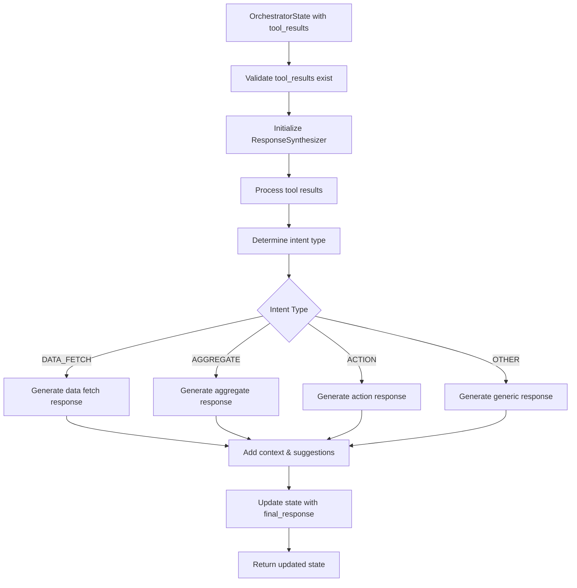

# Response Synthesis Node Documentation

## Overview

The Response Synthesis Node is a critical component of the Direct Orchestrator Subgraph that transforms tool execution results into natural language responses. It uses LLM-based synthesis with intent-specific formatting to generate conversational, informative responses for users.

## Key Features

- **LLM-Based Response Generation**: Uses advanced language models to create natural, contextual responses
- **Intent-Specific Processing**: Tailored response generation for different intent types (DATA_FETCH, AGGREGATE, ACTION)
- **Data Formatting Utilities**: Comprehensive formatting for financial data (currency, percentages, dates)
- **Tool Result Processing**: Intelligent aggregation and processing of multi-step tool results
- **Error Handling**: Graceful fallback mechanisms when LLM calls fail
- **Context-Aware Suggestions**: Smart follow-up suggestions based on intent and data
- **Template-Based Fallbacks**: Structured responses when LLM generation fails

## Architecture

### Core Components

#### 1. ResponseSynthesizer Class
The main orchestrator for response generation:

```python
class ResponseSynthesizer:
    def __init__(self, llm_client: Optional[LLMClient] = None):
        self.llm_client = llm_client or LLMClient()
        self.formatter = DataFormatter()
```

#### 2. DataFormatter Utility
Handles formatting of financial data:

```python
class DataFormatter:
    def format_currency(self, amount, currency="USD") -> str
    def format_percentage(self, value, precision=1) -> str
    def format_date(self, date_value, format_style="user_friendly") -> str
    def format_balances(self, balance_data) -> str
    def format_transactions(self, transactions, limit=10) -> str
    # ... and more
```

#### 3. Main Node Function
```python
async def response_synthesis_node(state: OrchestratorState) -> OrchestratorState
```

## Usage Examples

### Basic Usage

```python
from src.nodes.response_synthesis_node import response_synthesis_node

# State with tool results
state = OrchestratorState(
    session_id="session_123",
    user_input="Show my checking account balance",
    intent=IntentCategory.DATA_FETCH,
    tool_results={
        "step_0": {
            "success": True,
            "data": {"balance": 1000.50, "account_name": "checking"}
        }
    }
)

# Generate response
updated_state = await response_synthesis_node(state)
print(updated_state.final_response)
# Output: "Your checking account balance is $1,000.50."
```

### Data Fetch Intent

```python
# Tool results for balance query
tool_results = {
    "step_0": {
        "step_index": 0,
        "tool_name": "db_query",
        "operation": "get_account_balance",
        "success": True,
        "data": {
            "balance": 2500.75,
            "account_name": "checking"
        }
    }
}

# Response synthesis will generate:
# "Your checking account balance is $2,500.75."
```

### Aggregate Intent

```python
# Tool results for spending analysis
tool_results = {
    "step_0": {
        "success": True,
        "data": {
            "spending_by_category": [
                {"category_name": "Food", "total_amount": 500.00, "percentage": 0.25},
                {"category_name": "Transport", "total_amount": 300.00, "percentage": 0.15}
            ]
        }
    }
}

# Response synthesis will generate:
# "Your top spending category is Food at $500.00 (25.0%), followed by Transport at $300.00 (15.0%)."
```

### Action Intent

```python
# Tool results for money transfer
tool_results = {
    "step_0": {
        "success": True,
        "data": {
            "transaction_id": "txn_123456",
            "status": "completed",
            "amount": 100.00
        }
    }
}

# Response synthesis will generate:
# "Transfer completed successfully! Transaction ID: txn_123456"
```

## Execution Flow



## Data Processing

### Tool Result Processing

The node processes tool results through several stages:

1. **Step Classification**: Separates successful and failed steps
2. **Data Aggregation**: Combines data from multiple steps
3. **Execution Summary**: Calculates success rates and metadata
4. **Intent Routing**: Routes to appropriate response generator

### Data Aggregation Logic

```python
def _aggregate_step_data(self, aggregated_data, step_data):
    if "balance" in step_data:
        # Store under "balances" and directly for compatibility
        aggregated_data["balances"] = aggregated_data.get("balances", {})
        aggregated_data["balances"].update(step_data)
        aggregated_data["balance"] = step_data["balance"]
    elif "transactions" in step_data:
        # Extend transaction lists
        aggregated_data["transactions"] = aggregated_data.get("transactions", [])
        aggregated_data["transactions"].extend(step_data["transactions"])
    # ... handle other data types
```

## Response Generation Strategies

### 1. LLM-Based Generation (Primary)

Uses LLM with intent-specific prompts:

```python
# Data Fetch Prompt Example
system_prompt = """You are a helpful financial assistant. Generate clear, informative responses for data fetch requests.

RESPONSE GUIDELINES:
- Be conversational and helpful
- Format financial data clearly (use $ for amounts, % for percentages)
- Present data in a structured, easy-to-read format
- Include relevant context and insights
- Keep responses concise but informative
- Use bullet points or numbered lists for multiple items"""
```

### 2. Template-Based Fallbacks (Secondary)

When LLM fails, uses structured templates:

```python
def _generate_template_data_fetch_response(self, processed_data):
    data = processed_data["aggregated_data"]
    
    if "balance" in data:
        return f"Here are your account balances:\n\n{self.formatter.format_balances(data)}"
    elif "transactions" in data:
        return f"I found {len(data['transactions'])} transactions:\n\n{self.formatter.format_transactions(data['transactions'])}"
    # ... other templates
```

### 3. Error Handling (Tertiary)

Graceful degradation for complete failures:

```python
def _generate_fallback_response(self, state, tool_results):
    return f"I processed your request: '{state.user_input}', but encountered an issue generating a detailed response. Please try again or contact support if the problem persists."
```

## Data Formatting

### Currency Formatting

```python
formatter = DataFormatter()

# USD formatting
formatter.format_currency(1234.56)  # "$1,234.56"
formatter.format_currency(1000)     # "$1,000.00"

# Other currencies
formatter.format_currency(1000, "EUR")  # "€1,000.00"
formatter.format_currency(1000, "GBP")  # "£1,000.00"
```

### Percentage Formatting

```python
formatter.format_percentage(0.25)   # "25.0%"
formatter.format_percentage(25.5)   # "25.5%"
formatter.format_percentage(0.123)  # "12.3%"
```

### Date Formatting

```python
formatter.format_date("2024-01-15")                    # "January 15, 2024"
formatter.format_date("2024-01-15", "short")           # "Jan 15, 2024"
formatter.format_date("2024-01-15", "iso")             # "2024-01-15"
```

### Transaction Formatting

```python
transactions = [
    {
        "amount": -50.00,
        "description": "Grocery Store",
        "date": "2024-01-15",
        "category_name": "Food"
    }
]

formatter.format_transactions(transactions)
# Output:
# "1. Grocery Store: -$50.00 (Food) - Jan 15, 2024"
```

## Context and Suggestions

### Follow-up Suggestions

The node automatically adds context-aware suggestions:

```python
def _generate_follow_up_suggestions(self, state, processed_data):
    if state.intent == IntentCategory.DATA_FETCH:
        if "balances" in processed_data["aggregated_data"]:
            return "💡 You can ask me to analyze your spending patterns or set up budget alerts."
    elif state.intent == IntentCategory.AGGREGATE:
        if "spending_analysis" in processed_data["aggregated_data"]:
            return "💡 Consider setting up budget limits for high-spending categories."
```

### Example with Suggestions

```
Your checking account balance is $1,000.50.

💡 You can ask me to analyze your spending patterns or set up budget alerts.
```

## Error Handling

### Common Error Scenarios

1. **No Tool Results**
   ```python
   # Returns: "I'm sorry, but I couldn't process your request. Please try again."
   ```

2. **LLM API Failure**
   ```python
   # Falls back to template-based response
   ```

3. **Partial Tool Failures**
   ```python
   # Handles mixed success/failure scenarios gracefully
   ```

4. **Invalid Data Structures**
   ```python
   # Uses safe data access with .get() methods
   ```

### Error Response Structure

```python
{
    "final_response": "Error message for user",
    "metadata": {
        "synthesis_status": "error",
        "synthesis_errors": ["Error details"],
        "synthesis_time_ms": 150.5,
        "response_length": 45
    }
}
```

## Integration Points

### State Management

- **Input**: `OrchestratorState` with `tool_results`
- **Output**: Updated `OrchestratorState` with `final_response`
- **Metadata**: Execution timing, status, and error information

### Tool Registry Integration

- Uses `LLMClient` for response generation
- Integrates with existing tool execution results
- Maintains compatibility with tool result structure

### Message Management

- Adds system messages for tracking
- Records synthesis start/completion
- Maintains conversation context

## Performance Considerations

### LLM Call Optimization

- **Temperature Settings**: 
  - Data Fetch: 0.7 (balanced creativity)
  - Aggregate: 0.7 (insightful analysis)
  - Action: 0.6 (consistent confirmations)

- **Token Limits**:
  - Data Fetch: 1000 tokens
  - Aggregate: 1200 tokens
  - Action: 800 tokens

### Caching Strategy

- No built-in caching (stateless design)
- Can be extended with Redis/Memory caching
- Template responses serve as fast fallbacks

### Error Recovery

- **Primary**: LLM-based generation
- **Secondary**: Template-based responses
- **Tertiary**: Generic error messages

## Testing

### Test Coverage

The node includes comprehensive tests covering:

- **DataFormatter**: All formatting utilities
- **ResponseSynthesizer**: Core synthesis logic
- **Response Synthesis Node**: Main node function
- **Error Scenarios**: Various failure modes
- **Intent Types**: All supported intent categories

### Test Structure

```python
class TestDataFormatter:
    def test_format_currency_usd(self)
    def test_format_percentage_decimal(self)
    # ... formatting tests

class TestResponseSynthesizer:
    def test_process_tool_results_success(self)
    def test_generate_data_fetch_response_success(self)
    # ... synthesis tests

class TestResponseSynthesisNode:
    def test_response_synthesis_node_success(self)
    def test_response_synthesis_node_no_tool_results(self)
    # ... node tests
```

### Running Tests

```bash
# Run all response synthesis tests
python -m pytest tests/test_response_synthesis_node.py -v

# Run specific test class
python -m pytest tests/test_response_synthesis_node.py::TestDataFormatter -v

# Run with coverage
python -m pytest tests/test_response_synthesis_node.py --cov=src.nodes.response_synthesis_node
```

## Configuration

### Environment Variables

```bash
# LLM Configuration (inherited from LLMClient)
OPENAI_API_KEY=your_api_key
ANTHROPIC_API_KEY=your_api_key

# Response Generation Settings
RESPONSE_SYNTHESIS_TEMPERATURE=0.7
RESPONSE_SYNTHESIS_MAX_TOKENS=1000
```

### Customization Points

1. **Prompt Templates**: Modify system/user prompts for different intents
2. **Formatting Rules**: Extend DataFormatter for new data types
3. **Suggestion Logic**: Customize follow-up suggestions
4. **Error Messages**: Tailor error responses for your domain

## Troubleshooting

### Common Issues

1. **LLM API Errors**
   - Check API key configuration
   - Verify network connectivity
   - Review rate limits

2. **Data Formatting Issues**
   - Validate input data structure
   - Check currency/date formats
   - Review aggregation logic

3. **Response Quality Issues**
   - Adjust temperature settings
   - Refine prompt templates
   - Add more context to prompts

### Debug Information

The node provides detailed logging:

```python
logger.info(
    f"Response synthesis completed successfully",
    extra={
        "response_length": len(final_response),
        "synthesis_time_ms": synthesis_time,
        "session_id": state.session_id
    }
)
```

### Monitoring

Key metrics to monitor:

- **Synthesis Success Rate**: Percentage of successful LLM generations
- **Response Length**: Average response character count
- **Synthesis Time**: Average time to generate responses
- **Error Rates**: Frequency of different error types

## Future Enhancements

### Planned Features

1. **Response Caching**: Cache common responses for performance
2. **Multi-language Support**: Internationalization for responses
3. **Response Templates**: Configurable template system
4. **Quality Metrics**: Response quality scoring
5. **A/B Testing**: Test different response strategies

### Extension Points

1. **Custom Formatters**: Add domain-specific formatting
2. **Response Validators**: Validate response quality
3. **Context Enrichment**: Add more context sources
4. **Personalization**: User-specific response customization

## API Reference

### ResponseSynthesizer

```python
class ResponseSynthesizer:
    async def synthesize_response(
        self, 
        state: OrchestratorState, 
        tool_results: Dict[str, Any]
    ) -> str
    
    def _process_tool_results(self, tool_results: Dict[str, Any]) -> Dict[str, Any]
    
    async def _generate_data_fetch_response(
        self, 
        state: OrchestratorState, 
        processed_data: Dict[str, Any]
    ) -> str
    
    async def _generate_aggregate_response(
        self, 
        state: OrchestratorState, 
        processed_data: Dict[str, Any]
    ) -> str
    
    async def _generate_action_response(
        self, 
        state: OrchestratorState, 
        processed_data: Dict[str, Any]
    ) -> str
```

### DataFormatter

```python
class DataFormatter:
    def format_currency(self, amount, currency="USD") -> str
    def format_percentage(self, value, precision=1) -> str
    def format_date(self, date_value, format_style="user_friendly") -> str
    def format_balances(self, balance_data) -> str
    def format_transactions(self, transactions, limit=10) -> str
    def format_accounts(self, accounts) -> str
    def format_spending_analysis(self, spending_data) -> str
    def format_monthly_summary(self, summary_data) -> str
    def format_table(self, data, headers=None) -> str
```

### Main Node Function

```python
async def response_synthesis_node(state: OrchestratorState) -> OrchestratorState
```

## Conclusion

The Response Synthesis Node provides a robust, flexible system for generating natural language responses from tool execution results. Its LLM-based approach with comprehensive fallback mechanisms ensures reliable, high-quality responses across all intent types and data scenarios.

The node's modular design makes it easy to extend and customize for specific use cases while maintaining compatibility with the broader orchestrator architecture. 