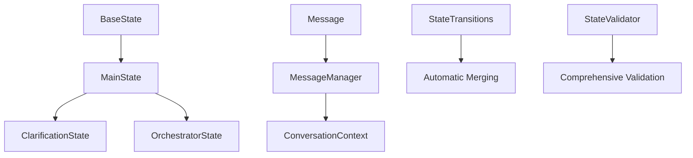

# State Schema Examples and Usage Guide

This document provides comprehensive examples of the hierarchical state schema system for LangGraph, demonstrating inheritance patterns, automatic transitions, message tracking, and conversation management.

## Schema Hierarchy Overview



## Basic Usage Examples

### 1. Creating a Base State

```python
from src.schemas.state_schemas import BaseState, MessageRole, IntentType, Message

# Create initial state from user input
base_state = BaseState(
    user_input="Show me my account balances from last month",
    intent=IntentType.DATA_FETCH,
    confidence=0.85
)

print(f"Session ID: {base_state.session_id}")
print(f"Intent: {base_state.intent}")
print(f"Confidence: {base_state.confidence}")
```

### 2. Message Management with Node Tracking

```python
from src.schemas.state_schemas import MessageManager

# Add user message
state = MessageManager.add_user_message(
    base_state, 
    "Show me my account balances from last month"
)

# Add assistant response with node tracking
state = MessageManager.add_assistant_message(
    state,
    "I'll help you fetch your account balances from last month. Let me gather that information.",
    node_name="intent_classification_node"
)

# Add system message for debugging
state = MessageManager.add_system_message(
    state,
    "Intent classified as DATA_FETCH with confidence 0.85",
    node_name="intent_classification_node"
)

print(f"Total messages: {len(state.messages)}")
print(f"Last message from: {state.messages[-1].node_name}")
```

### 3. Automatic Conversation Pruning

```python
# Simulate adding many messages - automatic pruning to 20 messages
for i in range(25):
    state = MessageManager.add_user_message(state, f"Message {i}")

print(f"Messages after pruning: {len(state.messages)}")  # Will be 20
print(f"Oldest message index: {state.messages[0].content}")  # Will be "Message 5"
```

## State Inheritance and Transitions

### 1. BaseState → MainState

```python
from src.schemas.state_schemas import MainState

# Inherit from BaseState and add execution-specific fields
main_state = MainState(
    user_input="Show me my top 5 transactions",
    intent=IntentType.DATA_FETCH,
    confidence=0.92,
    parameters={
        "query_type": "transactions",
        "limit": 5,
        "sort_by": "amount"
    }
)

print(f"Parameters: {main_state.parameters}")
```

### 2. MainState → ClarificationState (Automatic Transition)

```python
from src.schemas.state_schemas import StateTransitions, ClarificationState

# Convert MainState to ClarificationState when parameters are missing
clarification_state = StateTransitions.to_clarification_state(main_state)

# Update with missing parameters
clarification_state.missing_params = ["date_range", "account_type"]
clarification_state.clarification_attempts = 1

print(f"Missing params: {clarification_state.missing_params}")
print(f"Can attempt clarification: {clarification_state.can_attempt_clarification}")
print(f"Has missing params: {clarification_state.has_missing_params}")
```

### 3. Parameter Collection and Merging

```python
# Collect clarified parameters
clarification_state.clarified_params = {
    "date_range": "last_30_days",
    "account_type": "checking"
}

# Convert back to MainState with merged parameters
merged_main_state = StateTransitions.from_clarification_state(clarification_state)

print("Merged parameters:")
print(f"Original: {main_state.parameters}")
print(f"Clarified: {clarification_state.clarified_params}")
print(f"Final merged: {merged_main_state.parameters}")
```

### 4. MainState → OrchestratorState (Tool Execution)

```python
from src.schemas.state_schemas import OrchestratorState

# Convert to orchestrator state for tool execution
orchestrator_state = StateTransitions.to_orchestrator_state(merged_main_state)

# Set execution plan
orchestrator_state.execution_plan = {
    "tools": ["supabase_query_tool", "response_formatter_tool"],
    "sequence": ["fetch_transactions", "format_response"],
    "parameters": orchestrator_state.extracted_params
}

# Simulate tool execution results
orchestrator_state.tool_results = {
    "supabase_query_tool": {
        "status": "success",
        "data": [
            {"id": "1", "amount": 1500.00, "description": "Salary"},
            {"id": "2", "amount": -85.50, "description": "Grocery Store"},
            {"id": "3", "amount": -1200.00, "description": "Rent"},
        ],
        "count": 3
    },
    "response_formatter_tool": {
        "status": "success",
        "formatted_response": "Here are your top 3 transactions from the last 30 days..."
    }
}

# Set final response
orchestrator_state.final_response = orchestrator_state.tool_results["response_formatter_tool"]["formatted_response"]

print(f"Execution plan: {orchestrator_state.execution_plan}")
print(f"Final response: {orchestrator_state.final_response}")
```

### 5. Complete State Transition Flow

```python
# Complete flow: BaseState → MainState → ClarificationState → MainState → OrchestratorState → MainState

# 1. Start with base state
initial_state = BaseState(
    user_input="Show me my finances",
    intent=IntentType.DATA_FETCH,
    confidence=0.60  # Low confidence, needs clarification
)

# 2. Convert to main state
main_state = MainState(**initial_state.dict())

# 3. Convert to clarification state (missing parameters)
clarification_state = StateTransitions.to_clarification_state(main_state)
clarification_state.missing_params = ["time_period", "account_types", "data_format"]

# 4. Collect clarifications
clarification_state.clarified_params = {
    "time_period": "last_3_months",
    "account_types": ["checking", "savings"],
    "data_format": "summary"
}

# 5. Merge back to main state
clarified_main_state = StateTransitions.from_clarification_state(clarification_state)

# 6. Convert to orchestrator for execution
orchestrator_state = StateTransitions.to_orchestrator_state(clarified_main_state)

# 7. Final conversion back to main state with results
final_main_state = StateTransitions.from_orchestrator_state(orchestrator_state)

print("Complete transition flow completed successfully!")
print(f"Final parameters: {final_main_state.parameters}")
print(f"Final execution results: {final_main_state.execution_results}")
```

## Conversation Context and Management

### 1. Conversation Summarization

```python
from src.schemas.state_schemas import ConversationContext

# Create a state with conversation history
state_with_history = base_state
for i in range(10):
    state_with_history = MessageManager.add_user_message(state_with_history, f"User message {i}")
    state_with_history = MessageManager.add_assistant_message(
        state_with_history, 
        f"Assistant response {i}", 
        f"node_{i % 3}"
    )

# Get conversation summary
summary = ConversationContext.summarize_conversation(state_with_history)
print(summary)
```

### 2. Message Filtering and Context

```python
# Get recent context (last 5 messages)
recent_context = ConversationContext.get_recent_context(state_with_history, 5)
print(f"Recent context has {len(recent_context)} messages")

# Filter messages by role
user_messages = ConversationContext.get_messages_by_role(state_with_history, MessageRole.USER)
assistant_messages = ConversationContext.get_messages_by_role(state_with_history, MessageRole.ASSISTANT)

print(f"User messages: {len(user_messages)}")
print(f"Assistant messages: {len(assistant_messages)}")

# Filter messages by node
node_0_messages = ConversationContext.get_messages_by_node(state_with_history, "node_0")
print(f"Messages from node_0: {len(node_0_messages)}")
```

## Advanced Validation Examples

### 1. State Validation

```python
from src.schemas.state_schemas import StateValidator

# Validate base state
try:
    StateValidator.validate_base_state(base_state)
    print("Base state validation passed")
except ValueError as e:
    print(f"Validation error: {e}")

# Validate clarification state
try:
    StateValidator.validate_clarification_state(clarification_state)
    print("Clarification state validation passed")
except ValueError as e:
    print(f"Validation error: {e}")
```

### 2. State Transition Validation

```python
# Validate state transitions preserve required fields
try:
    StateValidator.validate_state_transition(main_state, clarification_state)
    print("State transition validation passed")
except ValueError as e:
    print(f"Transition validation error: {e}")
```

### 3. Custom Validation Scenarios

```python
# Test confidence validation
try:
    invalid_state = BaseState(
        user_input="Test",
        confidence=1.5  # Invalid: > 1.0
    )
except ValueError as e:
    print(f"Confidence validation caught: {e}")

# Test clarification attempts validation
try:
    invalid_clarification = ClarificationState(
        user_input="Test",
        clarification_attempts=5,  # Invalid: > max_attempts (3)
        max_attempts=3
    )
except ValueError as e:
    print(f"Clarification attempts validation caught: {e}")

# Test empty user input
try:
    invalid_input_state = BaseState(
        user_input="   "  # Invalid: empty after strip
    )
except ValueError as e:
    print(f"User input validation caught: {e}")
```

## Real-World Usage Patterns

### 1. LangGraph Node Implementation

```python
async def intent_classification_node(state: BaseState) -> MainState:
    """Example LangGraph node using state schemas."""
    
    # Add system message for tracking
    state = MessageManager.add_system_message(
        state,
        f"Processing intent classification for: {state.user_input[:50]}...",
        "intent_classification_node"
    )
    
    # Classify intent (mock implementation)
    if "balance" in state.user_input.lower():
        intent = IntentType.DATA_FETCH
        confidence = 0.85
    elif "pay" in state.user_input.lower():
        intent = IntentType.ACTION
        confidence = 0.90
    else:
        intent = IntentType.UNKNOWN
        confidence = 0.30
    
    # Convert to MainState with classified intent
    main_state = MainState(
        **state.dict(),
        intent=intent,
        confidence=confidence
    )
    
    # Add assistant response
    main_state = MessageManager.add_assistant_message(
        main_state,
        f"I've classified your request as {intent.value} with {confidence} confidence.",
        "intent_classification_node"
    )
    
    return main_state
```

### 2. Conditional State Routing

```python
def route_based_on_confidence(state: MainState) -> str:
    """Route to different nodes based on intent confidence."""
    
    if state.confidence is None or state.confidence < 0.7:
        # Low confidence - route to clarification
        return "clarification_subgraph"
    elif state.intent == IntentType.DATA_FETCH:
        return "data_fetch_subgraph"
    elif state.intent == IntentType.ACTION:
        return "action_execution_subgraph"
    else:
        return "fallback_node"
```

### 3. Error Handling with State

```python
def handle_node_error(state: BaseState, error: Exception, node_name: str) -> BaseState:
    """Handle errors while preserving state integrity."""
    
    # Add error tracking to metadata
    if "errors" not in state.metadata:
        state.metadata["errors"] = []
    
    state.metadata["errors"].append({
        "node": node_name,
        "error": str(error),
        "timestamp": datetime.now(timezone.utc).isoformat()
    })
    
    # Add system message for error tracking
    state = MessageManager.add_system_message(
        state,
        f"Error in {node_name}: {str(error)}",
        node_name
    )
    
    return state
```

## Configuration and Customization

### 1. Custom Message Limits

```python
from src.schemas.state_schemas import MAX_MESSAGE_LENGTH, MAX_CONVERSATION_HISTORY

# Custom pruning
custom_state = MessageManager.prune_conversation(state, max_messages=10)

# Custom message validation
class CustomMessage(Message):
    content: str = Field(max_length=2000)  # Custom limit
```

### 2. Extended State Schemas

```python
# Custom state for specific use cases
class FinancialAnalysisState(MainState):
    """Extended state for financial analysis workflows."""
    
    analysis_type: str = Field(..., description="Type of financial analysis")
    date_range: Optional[Dict[str, str]] = Field(None, description="Analysis date range")
    accounts_included: List[str] = Field(default_factory=list, description="Account IDs to include")
    analysis_results: Optional[Dict[str, Any]] = Field(None, description="Analysis computation results")
```

This comprehensive guide demonstrates the full capabilities of the hierarchical state schema system, including inheritance patterns, automatic transitions, message management, and real-world usage scenarios. 