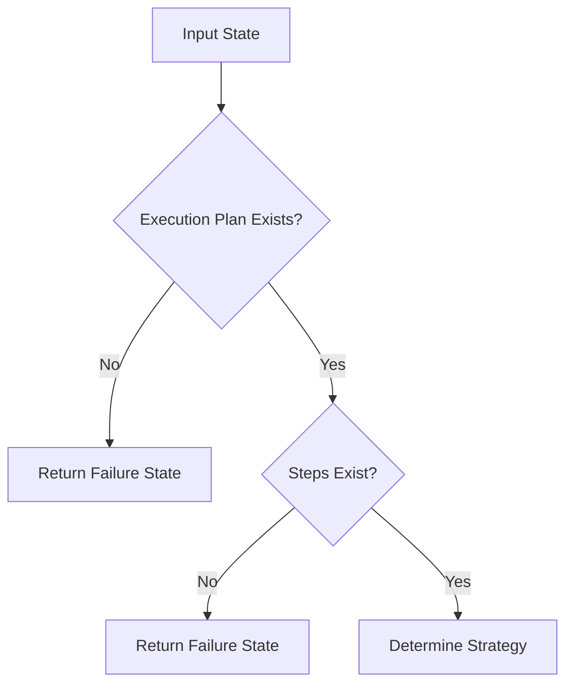
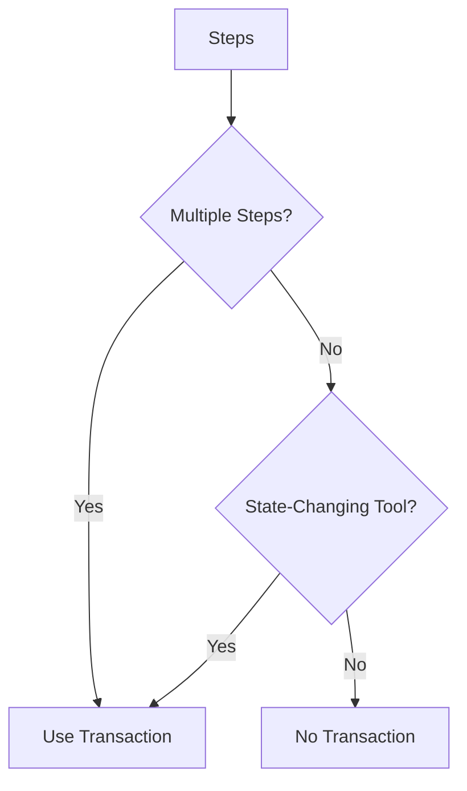
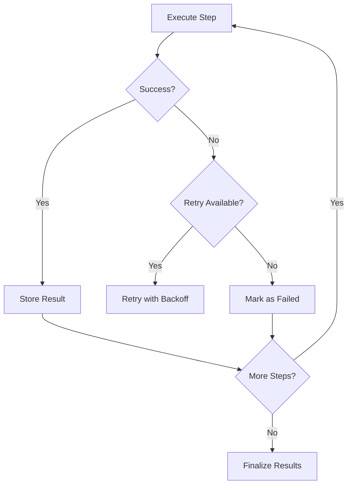

# Tool Execution Node Documentation

## Overview

The **Tool Execution Node** is a critical component of the Vyuu Copilot v2 Direct Orchestrator Subgraph that executes tools defined in an execution plan. It handles sequential tool execution, error handling, retries, database transactions, and comprehensive result collection.

## Key Features

### 🔧 **Sequential Tool Execution**
- Executes tools in the order specified in the execution plan
- Supports both single-step and multi-step operations
- Maintains execution order and dependency management

### 🛡️ **Robust Error Handling**
- Comprehensive error capture and reporting
- Retry logic with exponential backoff (configurable)
- Graceful degradation for partial failures
- Detailed error messages for debugging

### 💾 **Transaction Management**
- Automatic transaction detection for multi-step operations
- Database transaction support for state-changing operations
- Rollback capabilities on failure
- Configurable transaction strategies

### 📊 **Execution Monitoring**
- Detailed timing information for each step
- Success/failure tracking per step
- Comprehensive execution metadata
- Performance metrics collection

### 🔄 **Retry Logic**
- Configurable retry attempts (default: 3)
- Exponential backoff strategy
- Maximum delay limits
- Per-step retry tracking

## Architecture

### Core Components

#### 1. **ExecutionStepResult**
```python
class ExecutionStepResult:
    step_index: int
    tool_name: str
    operation: str
    success: bool
    data: Any
    error: str
    execution_time_ms: float
    retry_count: int
```

#### 2. **Execution Strategies**
- **No Transaction**: For single-step read operations
- **Transaction**: For multi-step or state-changing operations

#### 3. **Tool Registry Integration**
- Integrates with existing `TOOL_REGISTRY`
- Uses `get_tool()` and `get_tool_schema()` functions
- Validates parameters against tool schemas

## Usage

### Basic Usage

```python
from src.nodes.tool_execution_node import tool_execution_node
from src.schemas.state_schemas import OrchestratorState

# Create state with execution plan
state = OrchestratorState(
    execution_plan={
        "steps": [
            {
                "tool_name": "db_query",
                "operation": "get_account_balance",
                "params": {"account_name": "checking"}
            }
        ]
    }
)

# Execute tools
updated_state = await tool_execution_node(state)
```

### Multi-Step Execution

```python
state = OrchestratorState(
    execution_plan={
        "steps": [
            {
                "tool_name": "db_query",
                "operation": "get_account_balance",
                "params": {"account_name": "checking"}
            },
            {
                "tool_name": "db_action",
                "operation": "transfer_money",
                "params": {"amount": 100, "to_account": "savings"}
            }
        ]
    }
)

# This will use transaction mode automatically
updated_state = await tool_execution_node(state)
```

## Execution Flow

### 1. **Validation Phase**


### 2. **Strategy Determination**


### 3. **Execution Phase**


## Configuration

### Retry Configuration
```python
# In src/nodes/tool_execution_node.py
MAX_RETRY_ATTEMPTS = 3
RETRY_BASE_DELAY = 1.0  # seconds
RETRY_MAX_DELAY = 10.0  # seconds
```

### State-Changing Tools
```python
# Tools that automatically trigger transaction mode
state_changing_tools = {"db_action"}
```

## Output Structure

### Success Response
```python
{
    "tool_results": {
        "step_0": {
            "step_index": 0,
            "tool_name": "db_query",
            "operation": "get_account_balance",
            "success": True,
            "data": {"balance": 1000.0},
            "error": None,
            "execution_time_ms": 150.5,
            "retry_count": 0
        },
        "db_query": {  # Tool-specific key for successful operations
            # Same structure as step_0
        }
    },
    "metadata": {
        "execution_status": "success",
        "execution_errors": [],
        "execution_times": {
            "step_0": 150.5
        },
        "total_execution_time_ms": 150.5,
        "steps_completed": 1,
        "steps_failed": 0,
        "execution_strategy": "no_transaction"
    }
}
```

### Partial Failure Response
```python
{
    "tool_results": {
        "step_0": {"success": True, ...},
        "step_1": {"success": False, "error": "Database error", ...}
    },
    "metadata": {
        "execution_status": "partial_failure",
        "execution_errors": ["Step 2 failed: Database error"],
        "steps_completed": 1,
        "steps_failed": 1
    }
}
```

### Complete Failure Response
```python
{
    "tool_results": {},
    "metadata": {
        "execution_status": "failure",
        "execution_errors": ["Tool execution failed: Connection error"],
        "steps_completed": 0,
        "steps_failed": 1
    }
}
```

## Error Handling

### Error Types

1. **Validation Errors**
   - Missing execution plan
   - Empty steps list
   - Invalid tool names
   - Parameter validation failures

2. **Execution Errors**
   - Tool invocation failures
   - Database connection errors
   - Timeout errors
   - Unexpected exceptions

3. **Transaction Errors**
   - Transaction rollback failures
   - Database constraint violations
   - Connection pool exhaustion

### Retry Logic

```python
# Exponential backoff with jitter
delay = min(RETRY_BASE_DELAY * (2 ** attempt), RETRY_MAX_DELAY)
await asyncio.sleep(delay)
```

## Integration Points

### 1. **Tool Registry**
- Uses `TOOL_REGISTRY` for tool discovery
- Integrates with `get_tool()` and `get_tool_schema()`
- Validates tool responses against `ToolResponse` model

### 2. **Financial Service**
- Integrates with `get_financial_service()`
- Uses `account_repo.transaction()` for database transactions
- Handles transaction lifecycle management

### 3. **State Management**
- Updates `OrchestratorState` with execution results
- Maintains message history via `MessageManager`
- Preserves metadata for debugging and monitoring

### 4. **Logging**
- Structured logging with correlation IDs
- Performance metrics logging
- Error context preservation
- Debug information for troubleshooting

## Performance Considerations

### 1. **Timing Optimization**
- Precise execution time measurement
- Minimal overhead for timing calculations
- Efficient result aggregation

### 2. **Memory Management**
- Lazy evaluation of tool results
- Efficient state copying
- Minimal memory footprint

### 3. **Concurrency**
- Async/await for I/O operations
- Non-blocking retry logic
- Efficient transaction management

## Testing

### Test Coverage
- ✅ Single step execution
- ✅ Multi-step execution with transactions
- ✅ Error handling and retries
- ✅ Parameter validation
- ✅ Tool registry integration
- ✅ State management
- ✅ Execution strategy selection
- ✅ Exception handling
- ✅ Result structure validation

### Test Structure
```python
# Example test
@pytest.mark.asyncio
async def test_successful_execution():
    state = create_test_orchestrator_state()
    with patch('src.nodes.tool_execution_node._execute_without_transaction'):
        updated_state = await tool_execution_node(state)
        assert updated_state.metadata["execution_status"] == "success"
```

## Best Practices

### 1. **Execution Plan Design**
- Keep steps focused and atomic
- Use appropriate tool names and operations
- Provide complete parameter sets
- Consider transaction boundaries

### 2. **Error Handling**
- Implement proper error recovery
- Use meaningful error messages
- Log sufficient context for debugging
- Handle partial failures gracefully

### 3. **Performance**
- Monitor execution times
- Optimize tool implementations
- Use appropriate retry strategies
- Consider caching for repeated operations

### 4. **Monitoring**
- Track success/failure rates
- Monitor execution times
- Alert on repeated failures
- Maintain execution history

## Troubleshooting

### Common Issues

1. **"Tool not found in registry"**
   - Verify tool is registered in `TOOL_REGISTRY`
   - Check tool name spelling
   - Ensure tool module is imported

2. **"Parameter validation failed"**
   - Check parameter schema requirements
   - Verify parameter types and formats
   - Ensure required parameters are provided

3. **"Transaction failed"**
   - Check database connectivity
   - Verify transaction permissions
   - Review database constraints
   - Check for deadlocks

4. **"Execution timeout"**
   - Increase timeout configuration
   - Optimize tool performance
   - Check for blocking operations
   - Review retry strategy

### Debug Information

The node provides comprehensive debug information:
- Step-by-step execution logs
- Timing information for each step
- Retry attempt details
- Error context and stack traces
- Transaction lifecycle events

## Future Enhancements

### Planned Features
- **Parallel Execution**: Support for concurrent step execution
- **Conditional Execution**: Step execution based on conditions
- **Dynamic Retry**: Adaptive retry strategies
- **Circuit Breaker**: Automatic failure detection and recovery
- **Metrics Export**: Integration with monitoring systems
- **Caching**: Result caching for repeated operations

### Extension Points
- Custom execution strategies
- Pluggable error handlers
- Configurable retry policies
- Custom transaction managers
- Specialized result processors 